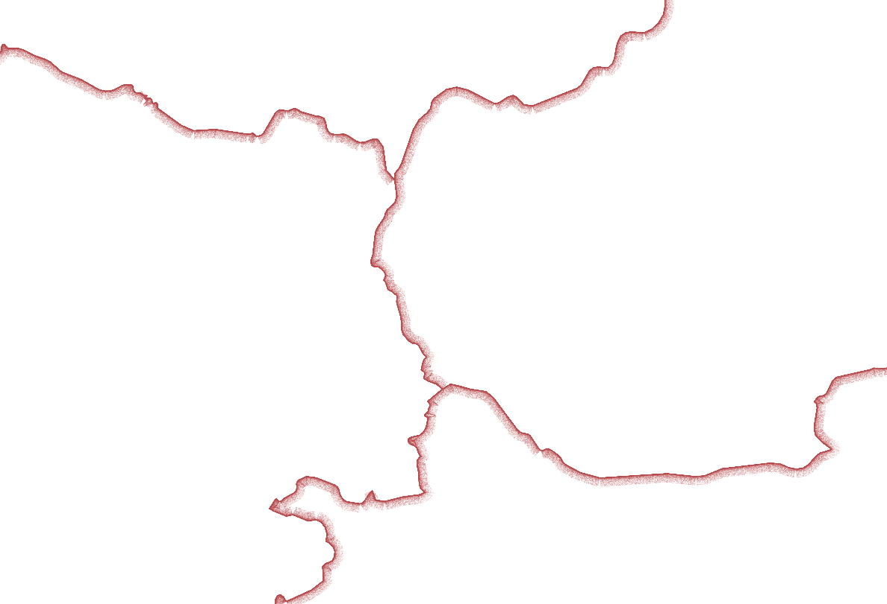

# QGIS Styles

### Load styles using QGIS style manager by either downloading xml files or using style url

### Neumorphic

### Borderline

For best results change feature blending mode to *Dodge*.

### Toktik

